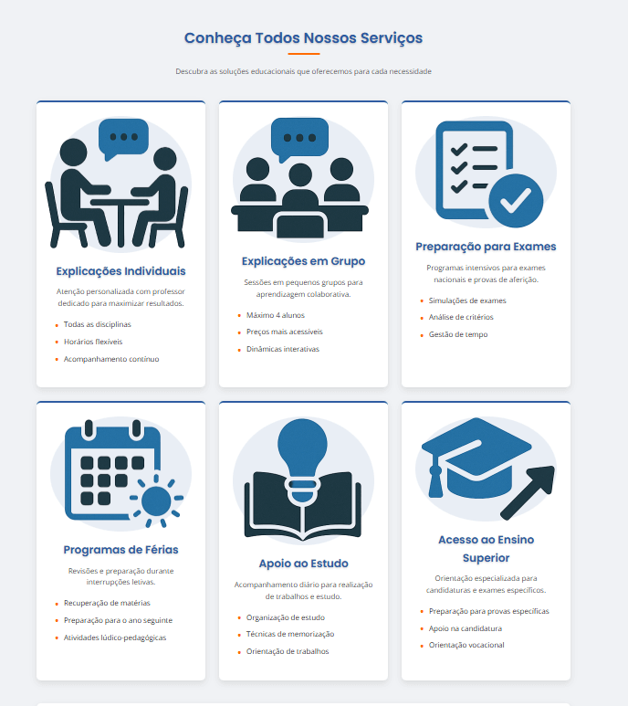

# inf24tig39

Repositório para alojar o projeto desenvolvido para 'Tecnologias Internet', uma unidade curricular do primeiro ano da Universidade da Maia. Desenvolvido pelo Grupo inf24tig39: [@César Ramos](https://github.com/devCesarRamos), [@Gonçalo Cidras](https://github.com/devCidras).

## Descrição do tema

O projeto consiste num website completo para o **Estudo360**, um centro de explicações que oferece serviços educacionais desde o 1º ano até ao ensino secundário. O site inclui:

- Página inicial com apresentação do centro
- Página de serviços com detalhes das ofertas educacionais
- Página da equipa com perfil dos professores
- Página de contactos com formulário e mapa
- Sistema dinâmico de carregamento de dados via XML/JavaScript

## Organização do repositório

- **Código fonte**:
  - [index.html](index.html) - Página inicial
  - [servicos.html](servicos.html) - Página de serviços
  - [equipa.html](equipa.html) - Página da equipa
  - [contactos.html](contactos.html) - Página de contactos
  - [css/style.css](css/style.css) - Estilos principais
  - [js/scripts.js](js/scripts.js) - Funcionalidades JavaScript
  - [servicos.xml](xml/servicos.xml) - Dados dos serviços
  - [servicos.xsd](xml/servicos.xsd) - Schema XML para validação
- **Documentação**: [doc/](doc/)
  - [c1.md](doc/c1.md) - Apresentação do projeto
  - [c2.md](doc/c2.md) - Interface do utilizador
  - [c3.md](doc/c3.md) - Produto final
  - [c4.md](doc/c4.md) - Apresentação

## Galeria

| Página Inicial                     | Página de Serviços                     |
| ---------------------------------- | -------------------------------------- |
|  |  |

| Página da Equipa                   | Página de Contactos                      |
| ---------------------------------- | ---------------------------------------- |
|  |  |

## Tecnologias

- XML/XSD
- HTML5 + CSS3
- JavaScript

## Frameworks e Libraries

- Font Awesome
- Google Fonts

## Report

### Project presentation

- Capítulo 1: [Apresentação do Projeto](doc/c1.md)

### User Interface

- Capítulo 2: [Interface do Utilizador](doc/c2.md)

### Product

- Capítulo 3: [Produto](doc/c3.md)

### Presentation

- Capítulo 4: [Apresentação](doc/c4.md)

## Equipa

- César Ramos [@CésarRamos](https://github.com/devCesarRamos)
- Gonçalo Cidras [@GonçaloCidras](https://github.com/devCidras)
