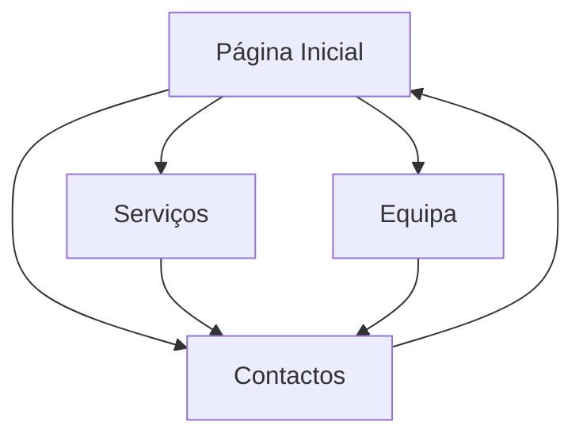

# Capítulo 1: Apresentação do Projeto

## 1.1 Contexto e Objetivos

O **Estudo360** é um centro de explicações fictício que oferece serviços educacionais para alunos do 1.º ao 12.º ano. Este projeto consiste num website completo desenvolvido com tecnologias web modernas (HTML5, CSS3 e JavaScript), cumprindo os seguintes objetivos principais:

- Criar uma plataforma informativa sobre serviços educacionais
- Apresentar a equipa de professores qualificados
- Disponibilizar canais de contacto para potenciais clientes
- Implementar uma experiência responsiva e acessível
- Demonstrar boas práticas de desenvolvimento web front-end

## 1.2 Escopo do Projeto

O website desenvolvido contempla:

1. **4 páginas estáticas interligadas:**

   - Página Inicial (index.html)
   - Serviços (servicos.html)
   - Equipa (equipa.html)
   - Contactos (contactos.html)

2. **Integração de tecnologias:**

   - HTML5 semântico para estruturação de conteúdo
   - CSS3 para estilização avançada e responsividade
   - JavaScript para interatividade e manipulação de dados
   - XML/XSD para estruturação e validação de dados

3. **Funcionalidades-chave:**
   - Sistema de navegação intuitivo
   - Apresentação multimédia da equipa (fotos + áudio)
   - Formulário de contacto funcional
   - Tabela de preços gerada dinamicamente a partir de XML
   - Design responsivo para diferentes dispositivos

## 1.3 Público-Alvo

O website destina-se a:

- Estudantes do ensino básico e secundário
- Pais e encarregados de educação
- Professores interessados em oportunidades de colaboração
- Instituições educacionais parceiras

## 1.4 Estrutura do Sítio Web

## Grupo inf24tig39

- César Ramos [@César Ramos](https://github.com/devCesarRamos)
- Gonçalo Cidras [@Gonçalo Cidras](https://github.com/devCidras)

---

| < Previous | [^ Main](../../../) | [Next >](c2.md) |
| :--------- | :-----------------: | --------------: |
