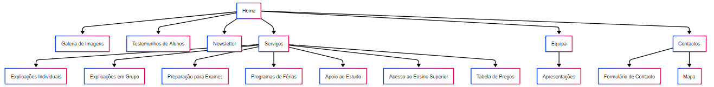

# Capítulo 2: Interface do Utilizador

## 2.1 Organização da Informação

O website foi desenvolvido com uma abordagem **"Mobile First"**, priorizando a experiência em dispositivos menores antes de expandir para desktop. A organização da informação segue estes princípios:

- **Hierarquia visual clara** com uso de cores, espaçamento e tipografia
- **Navegação simplificada** com menu responsivo que se adapta a diferentes tamanhos de ecrã
- **Conteúdo modular** organizado em seções distintas em cada página
- **Design consistente** com elementos visuais recorrentes em todas as páginas

## 2.2 Abordagem Mobile First

A implementação seguiu estas etapas:

1. **Design para dispositivos móveis:**

   - Menu compacto com ícone hamburger
   - Conteúdo em coluna única
   - Botões e elementos interativos com tamanho adequado para toque
   - Redução de elementos não essenciais

2. **Adaptação progressiva para desktop:**
   - Ativação de layout multi-coluna
   - Expansão do menu de navegação
   - Ajuste de tamanhos de fonte e elementos
   - Adição de elementos visuais complementares

## 2.3 Sitemap

|                Sitemap                |
| :-----------------------------------: |
|  |

---

| < [Previous](c1.md) | [^ Main](../../../) | [Next >](c3.md) |
| :------------------ | :-----------------: | --------------: |
